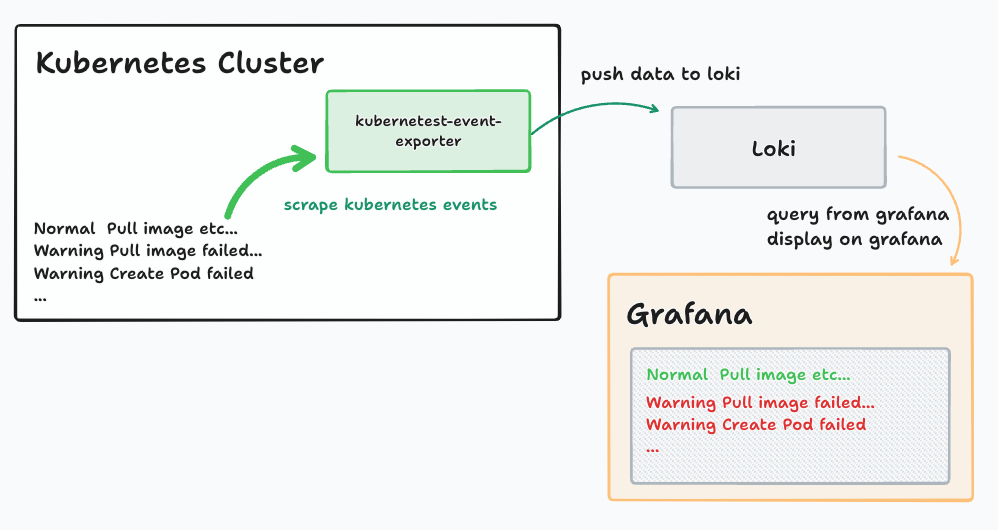
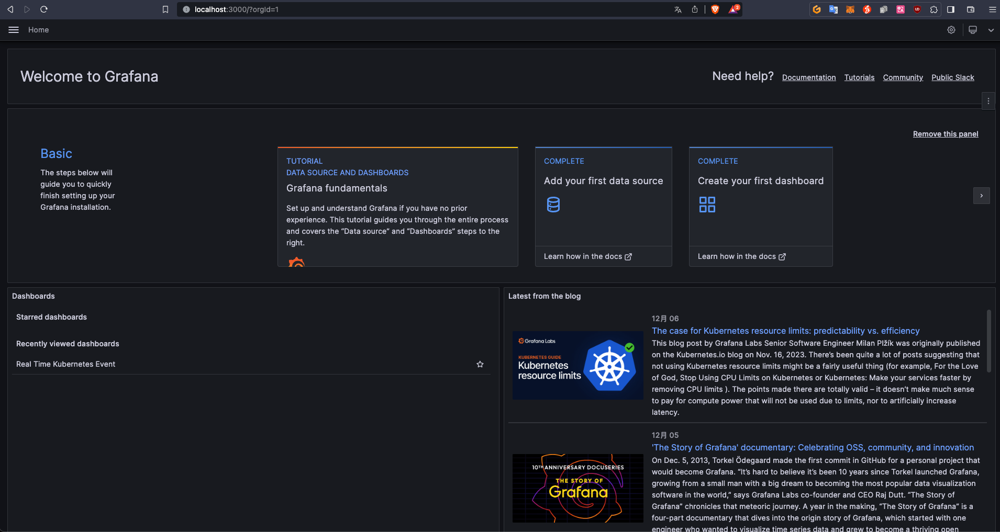
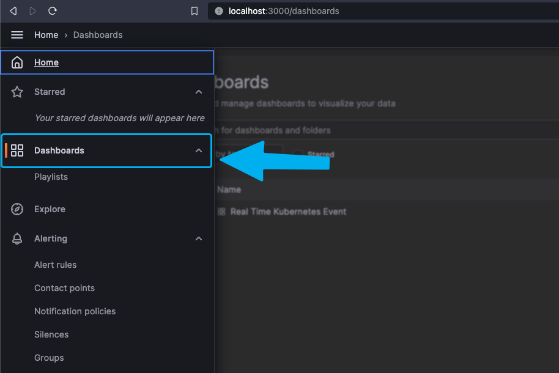
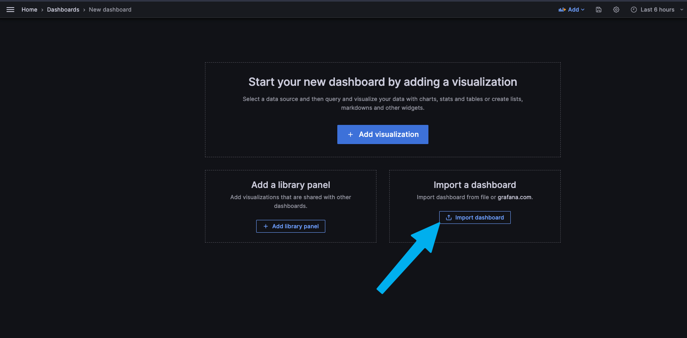
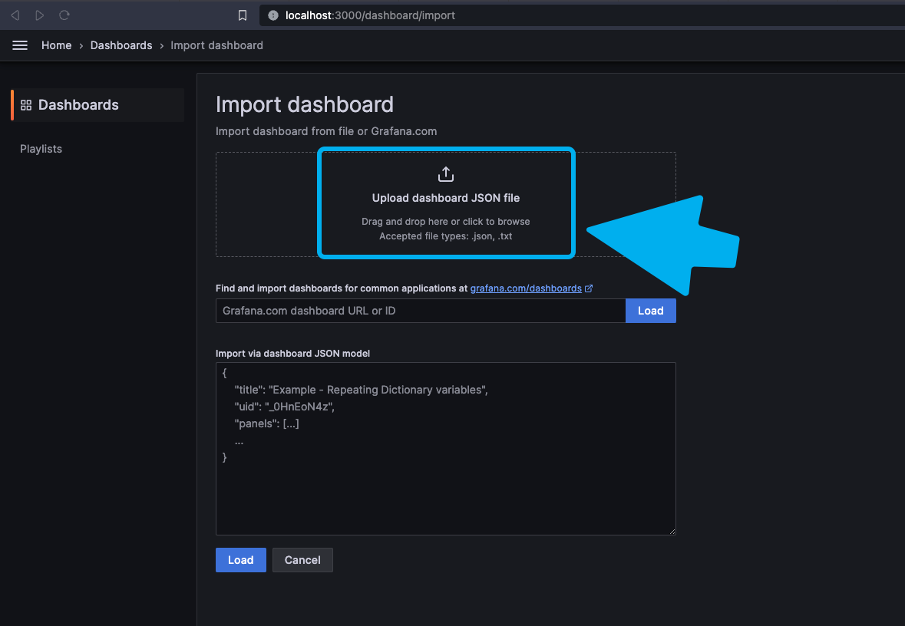
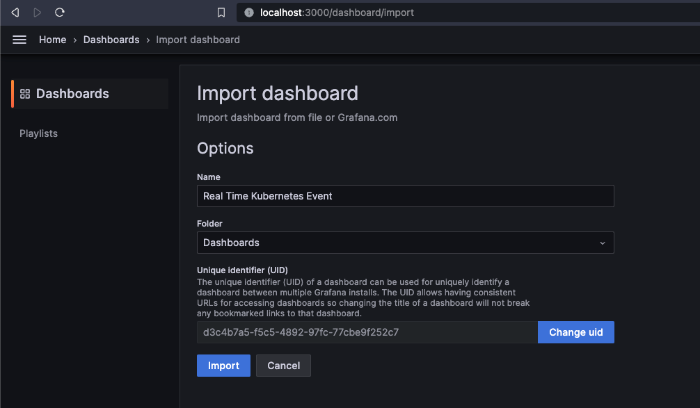
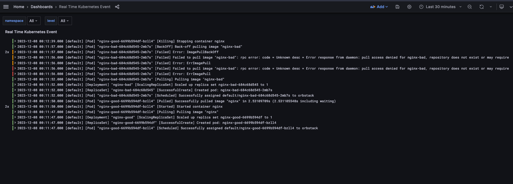
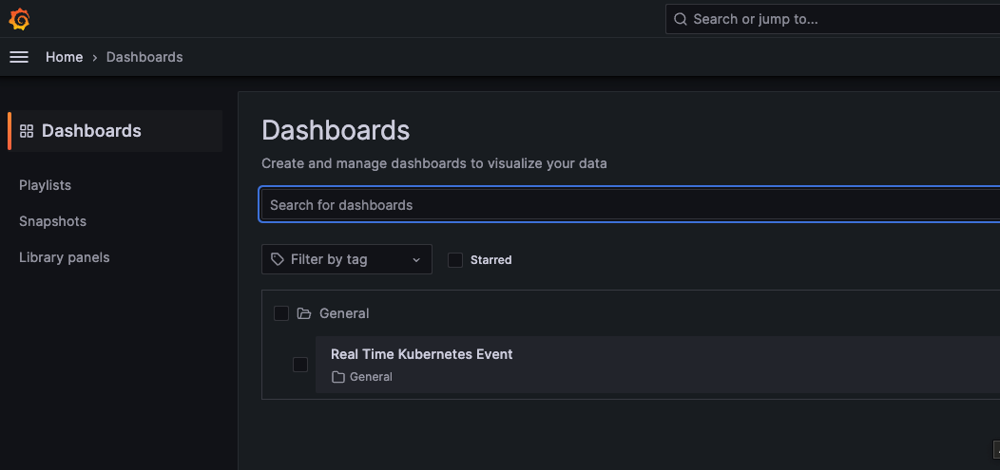
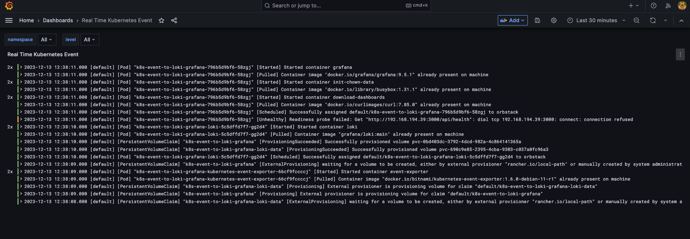

# Kubernetes Event Exporter with Loki and Grafana



## source
- [Kubernetes Event Exporter Helm Chart](https://github.com/bitnami/charts/tree/main/bitnami/kubernetes-event-exporter)
- [Kubernetes Event Exporter](https://github.com/resmoio/kubernetes-event-exporter)
## 🚨 🚨 🚨 Before install helm chart, Please update the `$LOKI_URL` in `values.yaml` file. 🚨 🚨 🚨
> If you use docker compose to run loki and grafana, you can input your compute IP at LOKI_URL.

`values.yaml`
```yaml
config:
  logLevel: debug
  metricsNamePrefix: 'event_exporter_'
  logFormat: json
  receivers:
    # - name: dump
    #   file:
    #   layout: {}
    #   path: /dev/stdout
    - name: loki
      loki:
        streamLabels:
          app: kubernetes-event-exporter
          dataCenter: local-cluster
        url: http://$LOKI_URL:3100/loki/api/v1/push
        # layout:
```

### Install with helm chart
```bash
helm upgrade -i kubernetes-event-exporter \
oci://registry-1.docker.io/bitnamicharts/kubernetes-event-exporter \
--values values.yaml --debug --version 2.10.0
```


### (Optional): Install Loki and Grafana with docker compose
```bash
docker compose up -d 
```

open [http://localhost:3000](http://localhost:3000)


Select Dashboard


Import dashboard


Upload dashboard JSON file use dashboard.json in this project


Select Import


Make some event into your cluster
```bash
ex:

kubectl create deploy nginx-good --image=nginx

kubectl create deploy nginx-bad --image=nginx-bad

```

Demo Dashboard



---
Clean up
```bash
helm uninstall kubernetes-event-exporter
```

Docker Compose down
```bash
docker compose down
```

---
## ALL in Kubernetes Example
```bash
helm repo add k8s-event-to-loki-grafana https://neilkuan.github.io/k8s-event-to-loki-grafana/

helm upgrade -i k8s-event-to-loki-grafana k8s-event-to-loki-grafana/k8s-event-to-loki-grafana

Release "k8s-event-to-loki-grafana" does not exist. Installing it now.

--- example output ---
NAME: k8s-event-to-loki-grafana
LAST DEPLOYED: Wed Dec 13 12:38:04 2023
NAMESPACE: default
STATUS: deployed
REVISION: 1
NOTES:
* Grafana URL should be:
svc_name=$(kubectl get svc -l 'app.kubernetes.io/name=grafana' -o name)

kubectl get $svc_name 

port forward to localhost 
kubectl port-forward $svc_name 3000:3000

Grafana Admin:
user: admin
password: k8s-event-to-loki-grafana

--- end ---
```

### Run Port Forward to Grafana Service
```bash
svc_name=$(kubectl get svc -l 'app.kubernetes.io/name=grafana' -o name)
kubectl get $svc_name
kubectl port-forward $svc_name 3000:3000

--- example output ---
orwarding from 127.0.0.1:3000 -> 3000
Forwarding from [::1]:3000 -> 3000
...
--- end ---
```
### Open `localhost:3000`
- user: `admin`
- password: `k8s-event-to-loki-grafana`







Clean up
```bash
helm uninstall k8s-event-to-loki-grafana    
release "k8s-event-to-loki-grafana" uninstalled
```
---
Loki query example
1. label_format level=`info`
```sql
{app="kubernetes-event-exporter"} |= `` | json | line_format `[{{.metadata_namespace}}] [{{.involvedObject_kind}}] "{{.involvedObject_name}}" [{{.reason}}] {{.message}}` | type=~`Normal` | label_format  level=`info` | metadata_namespace =~ `$namespace`
```

1. label_format level=`warning`
```sql
{app="kubernetes-event-exporter"} |= `` | json | line_format `[{{.metadata_namespace}}] [{{.involvedObject_kind}}] "{{.involvedObject_name}}" [{{.reason}}] {{.message}}` | type=~`Warning` | label_format  level=`warning` | metadata_namespace =~ `$namespace`
```

1. label_format level=`error`
```sql
{app="kubernetes-event-exporter"} |= `` | json | line_format `[{{.metadata_namespace}}] [{{.involvedObject_kind}}] "{{.involvedObject_name}}" [{{.reason}}] {{.message}}` | reason=~`Failed`| label_format  level=`error` | metadata_namespace =~ `$namespace``
```
